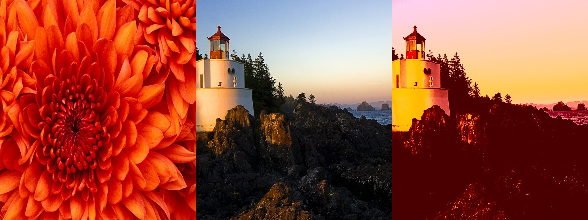
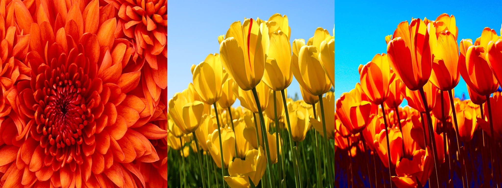
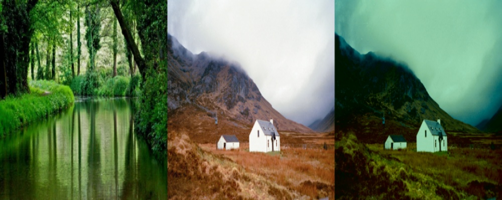
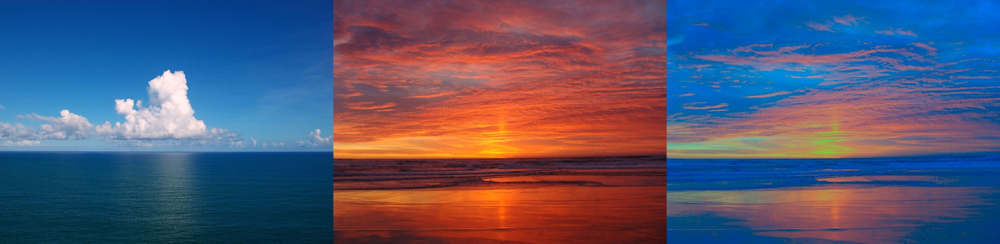

# super_fast_colour_transfer_between_images

Applying photoshop effects seems very interesting and delightful! One of such photoshop effects is "colour transfer between images". Suppose you have a picture of sun-rise. What if we convert it to sun-set? All we need to do is changing the background lighting.

Being a python enthusiast, I applied this photoshop effect using python and OpenCV! The user needs to provide the source and the target images. Then, the program outputs the desired result - the background colour of source image is applied to the target image.

## Colour-Transfer algorithm

This algorithm is very simple, based on the one proposed by Reinhard and his team. It utilizes the mean and standard deviation of each Lab channels.

1. Convert both the source and the target images to Lab colour space.

2. Split the channels.

3. Compute mean and standard deviation of each of the channels.

4. Apply this for every channel :
> target_channel = (target_channel - target_mean) * (target_std / source_std) + source_mean

You can figure it out how the normal distribution of corresponding source and target channels are equated.

5. Clip the channel values between 0 and 255.

6. Merge the channels together and convert it back to RGB colour space.

## Results

